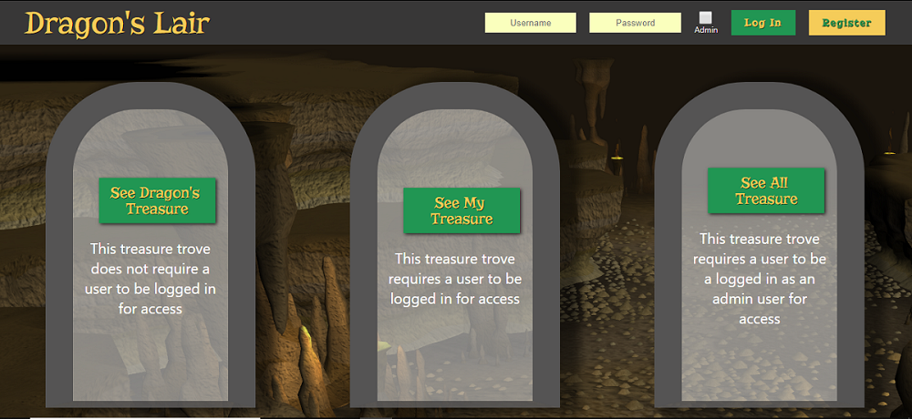

# Bcrypt Dragon's Lair

The purpose of this project is to implement secure password authentication using the Bcrypt library. Bcrypt is used to salt and hash user passwords, so that we avoid storing plain-text passwords in the database. We will also practice front to back data transmission, from axios calls on the front-end, to express endpoints on the server, to SQL commands in the database. 

# Example




## Setup

* `fork` and `clone` this repository
* Open the `bcrypt-start` branch
* `cd` into the root of the project
* Run `npm install`
* Run `npm start`

At this point the app should load in the browser and you should see the view of three treasure hoards and the login bar at the top. None of the buttons are connected to functions at this point.

## Step 1 - Setup

### Part 1 (Server Setup)

#### Summary

Here we will set up the server and get it listening on a port. We will install and require the necessary npm packages in order to do this.

#### Instructions

Here we will create the server file.

* Create a folder called server on the root.
* Create a file called `index.js` in the server folder.
* Install and require the following packages and store them on const variables
  * express
  * express-session
  * massive
  * body-parser
  * dotenv
    * When you require dotenv, immediately invoke the config method from this module.
* Define a const variable called app equal to express invoked.
* Define a const variable called PORT equal to 4000
* Use the json method of the body-parser package as top level middleware.  
* Make the server listen on this port number using app.listen
* Run nodemon and make sure there are no bugs.

#### Solution

<details>

<summary> <code> server/index.js </code> </summary>

```js
require('dotenv').config();
const express = require('express');
const session = require('express-session');
const massive = require('massive');
const bodyParser = require('body-parser');

const PORT = 4000;

const app = express()

app.use(bodyParser.json());

app.listen(PORT, ()=>console.log(`Listening on port ${PORT}`))
```

</details>

<br />

### Part 2 (Database Setup)

#### Summary

Here we will connect the server to the database using massive. We will create a .env file on the root of the project to store our personal data such as the database connection string. We will also set up session top-level middleware.

#### Instructions

Here we will create a .env file to store the database connection string.

* Create a file in the root directory called `.env`
* Store a value here called `CONNECTION_STRING`, the value should come from your heroku db settings.
* Store a value here called `SESSION_SECRET` and make up any value for this.
* In `index.js`, destructure `CONNECTION_STRING` and `SESSION_SECRET` from `process.env`, storing it on a `const` variable.
* Create the database connection by invoking massive and passing in the `CONNECTION_STRING`.
* Add a `.then` on the massive invocation passing in a function, and store the resulting database connection using `app.set`.
* Set up session as top-level middleware by invoking `app.use` and passing in session invoked with a configuration object.
  * The session configuration object should have properties `resave` set to true, `saveUninitialized` set to false, and `secret` set to `SESSION_SECRET`.
* Take the contents of `seed.sql` in the DB folder and run that in your database using SQL tabs. This will create the necessary user and treasure tables.

#### Solution

<details>
<summary><code> .env </code></summary>

```
CONNECTION_STRING=string_from_heroku_db
SESSION_SECRET=asdfa12341234
```

</details>
<details>
<summary><code> server/index.js </code></summary>

```js
require('dotenv').config();
const express = require('express');
const session = require('express-session');
const massive = require('massive');
const bodyParser = require('body-parser');

const PORT = 4000;

const { SESSION_SECRET, CONNECTION_STRING } = process.env;

const app = express();

app.use(bodyParser.json());

massive(CONNECTION_STRING).then(db => {
  app.set('db', db);
  console.log('db connected');
});

app.use(
  session({
    resave: true,
    saveUninitialized: false,
    secret: SESSION_SECRET,
  })
);

app.listen(PORT, () => console.log(`Listening on port ${PORT}`));

```

</details>

## Step 2 - Register

### Part 1 (Backend)

#### Summary 

Here We will create an auth controller file and import the bcryptjs package here. We will also build the server endpoint that we will use to register a new user.

#### Instructions

* Create a folder called controllers in server.
* Create a file called `authController.js` in controllers.
* Open `server/index.js` and require the authController.js file storing it on a const variable called ac.

* In `server/index.js` we will create the register endpoint.
* Create a POST endpoint with '/auth/register' as the URL and ac.register as the controller function.

* Go back to authController.js and create a register method with parameters req and res. We will use `async` and `await`, so make sure to use the `async` keyword before the function.
* Destructure username, password and isAdmin from req.body.
* Get the database instance and run the sql file `get_user`, passing in username. This query will check the database to see if there if the username is already taken. Since this query is asynchronous, make sure to use the await keyword to ensure that the promise resolves before the rest of the code executes.
* If existingUser is defined, send a response with status 409 and the text 'Username taken');
* Otherwise, create a const variable called salt, equal to `bcrypt.genSaltSync(10)`.
* Create a const variable called `hash`, equal to `bcrypt.hashSync(password, salt)`.
* Asynchronously (using await) run the `register_user` SQL file, passing in isAdmin, username, and hash as parameters (in that order).
* Set the value of this SQL query to a variable called user.
    * It will come as an array, and we just need the first element in the array. 
* Set req.session.user to be an object with properties isAdmin, id, and username, equal to user.is_admin, user.id, and user.username.
* do a `res.status` and `send` with the status being `201` for created and send the user object on session we just created.
* Now let's test our endpoint with postman.
    * Open postman and enter `http://localhost:4000/auth/register` in the URL input and send the following as raw JSON on the body of your request:

<details><summary>Postman JSON Body - Register</summary>

```json
{
  "username": "mrsmee",
  "password": "1stM84Lyfe",
  "isAdmin": false
}

```

</details>

You should receive the following as a response if your request was successful. If nothing went wrong, we have now registered a non-admin user and you should be able to see the new user in the `users` table of your database.

<details><summary>Postman JSON Response - Register</summary>

```json
{
  "isAdmin": false,
  "username": "mrsmee",
  "id": 4
}

```

#### Solution

<details><summary><code> server/controllers/authController.js </code></summary>

```js
const bcrypt = require('bcryptjs');

module.exports = {
  register: async (req, res) => {
    const { username, password, isAdmin } = req.body;
    const db = req.app.get('db');
    const result = await db.get_user([username]);
    const existingUser = result[0];
    if (existingUser) {
      return res.status(409).send('Username taken');
    }
    const salt = bcrypt.genSaltSync(10);
    const hash = bcrypt.hashSync(password, salt);
    const registeredUser = await db.register_user([isAdmin, username, hash]);
    const user = registeredUser[0];
    req.session.user = { isAdmin: user.is_admin, username: user.username, id: user.id };
    return res.status(201).send(req.session.user);
  },
};
```

</details>

<details><summary><code> server/index.js </code></summary>

```js
require('dotenv').config();
const express = require('express');
const session = require('express-session');
const massive = require('massive');
const bodyParser = require('body-parser');
const authCtrl = require('./controllers/authController');

const PORT = 4000;

const { SESSION_SECRET, CONNECTION_STRING } = process.env;

const app = express();

app.use(bodyParser.json());

massive(CONNECTION_STRING).then(db => {
  app.set('db', db);
  console.log('db connected');
});

app.use(
  session({
    resave: true,
    saveUninitialized: false,
    secret: SESSION_SECRET,
  })
);

app.post('/auth/register', authCtrl.register);

app.listen(PORT, () => console.log(`Listening on port ${PORT}`));
```
</details>

</details>

### Part 2 (Frontend)

#### Summary

In this step, we will add logic to our front end that will interact with the register endpoint that we just created. By the end of this step, a new user will be able to register for the application using the form inputs in the header.

#### Instructions

Since the user object is stored on state in `App.js`, but the input boxes and the methods that update state with their value are stored in `Header.js`, we will make the HTTP request in `Header.js` and call a method passed as a prop from `App.js` with the response from the request as an argument.

* Open `Header.js`
* Install and import axios.
* In the `register` method, use axios to send a POST request to `/auth/register`.
  * Destructure `username`, `password`, and `isAdmin` properties from state.
  * Send along an object with `username`, `password`, and `isAdmin` properties with the correct values from state as the body of the request.
  * In the .then of the axios request, set username and password on state to empty strings, using setState.
  * Also in the .then, invoke this.props.updateUser passing in the response data from our request, so that we can update the user object on App.js.
  * Chain a `.catch` onto the `.then` method with a callback function that contains the error as a parameter, and `alert` the `response.request.response`. Unfortunately, that path is the only way to get access to the error string that we sent as a response if the status code is not a 201. Dont forget to clear the input boxes using `setState` as well. 

```js
  .catch(err => {
      this.setState({ username: '', password: '' })
      alert(err.response.request.response)
  })
```

  * Test your application by entering a username and a password and clicking the register button. The header should switch to display a welcome message and a logout button. The logout button shouldn't work yet, so to test the error handling of our endpoint, refresh the page to get the input boxes back.
  * Try registering again with the same username. You should see an alert that says 'Username taken'.

#### Solution

<details><summary><code>src/Components/Header/Header.js</code></summary>

```js
  register() {
    const { username, password, isAdmin } = this.state;
    axios
      .post('/auth/register', { username, password, isAdmin })
      .then(user => {
        this.setState({ username: '', password: '' });
        this.props.updateUser(user.data);
      })
      .catch(err => {
        this.setState({ username: '', password: '' });
        alert(err.response.request.response);
      });
  }
```

</details>

## Step 3 - Login

### Part 1 (Backend)

#### Summary

Now that we are successfully able to register, lets create the login endpoint so an existing user can now log in.

#### Instructions

This endpoint will take a username and password off of the body and check if there is a user already exists by that username in the database. If the user is not in the database, our endpoint should respond with a 401 status code (unauthorized) since we were not able to authorize the user based on the fact that the username isn't registered. The endpoint should then compare the plain text password sent by the user to the salted and hashed version in our database. At that point, the endpoint should respond with a 200 (OK) status code if the password matches, or a 403 (Forbidden) status code if the password doesn't match.

* In server/index.js we will create the login endpoint.
* Create a POST endpoint with '/auth/login' as the URL and ac.login as the controller function.

* Create a property called login on the `authController` exports object, with the value of an async function that takes a req and res parameter.
* Destructure username and password from `req.body`, storing them on const variables.
* Get the database instance using `req.app.get('db')`
* Using the `get_user` SQL file, query the database for a user with a username matching the username from req.body. Make sure to use the `await` keyword to ensure the promise resolves before referencing the data.
* Store the result of the SQL query on a const variable called foundUser.
  * Remember that SQL queries come back in an array, so take the first item of the foundUser array and set it to another const variable called `user`.
* If there is no user found, send a response with status 401, and the string 'User  not found. Please register as a new user before logging in.'
* Otherwise, create a const variable called `isAuthenticated` and set it equal to `bcrypt.compareSync(password, user.hash)`. This method compares the password entered by the user at login to the hashed and salted version stored in the database.
* If isAuthenticated is false, send a response with status code 403, and the string 'Incorrect password'.
* Otherwise, set `req.session.user` to be an object with the same properties as the user object from the register endpoint, but using the data retreived from the `get_user` query.
* Then send `req.session.user` as a response with status code 200.
* Now test your endpoint with postman. Paste the following into the body section of the request as raw JSON.

<details><summary> Postman JSON Body - Login </summary>

```json
{
  "username": "mrsmee",
  "password": "1stM84Lyfe"
}
```

</details>

You should receive the following response.

<details><summary>Postman Response - Login</summary>

```json
{
  "isAdmin": false,
  "username": "mrsmee",
  "password": "1stM84Lyfe"
}
```

</details>

Also, try modifying the password so that it is incorrect. You should receive `Incorrect password` as a response.

#### Solution

<details><summary><code> server/controllers/authController.js </code></summary>

```js
const bcrypt = require('bcryptjs');

module.exports = {
  register: async (req, res) => {
    const { username, password, isAdmin } = req.body;
    const db = req.app.get('db');
    const result = await db.get_user([username]);
    const existingUser = result[0];
    if (existingUser) {
      return res.status(409).send('Username taken');
    }
    const salt = bcrypt.genSaltSync(10);
    const hash = bcrypt.hashSync(password, salt);
    const registeredUser = await db.register_user([isAdmin, username, hash]);
    const user = registeredUser[0];
    req.session.user = { isAdmin: user.is_admin, username: user.username, id: user.id };
    return res.status(201).send(req.session.user);
  },

  login: async (req, res) => {
    const { username, password } = req.body;
    const foundUser = await req.app.get('db').get_user([username]);
    const user = foundUser[0];
    if (!user) {
      return res.status(401).send('User  not found. Please register as a new user before loggin in.');
    }
    const isAuthenticated = bcrypt.compareSync(password, user.hash);
    if (!isAuthenticated) {
      return res.status(403).send('Incorrect password');
    }
    req.session.user = { isAdmin: user.is_admin, id: user.id, username: user.username };
    return res.send(req.session.user);
  },
};
```

</details>

<details><summary><code> server/index.js </code></summary>

```js

app.post('/auth/register', authCtrl.register);
app.post('/auth/login', authCtrl.login);

```
</details>


### Part 2 (FrontEnd)

#### Summary

Now that we are successfully able to login, lets code out our front end to take advantage of the endpoint.

#### Instructions

* Open `src/Components/Header/Header.js`
* Our `login()` method is connected to the login button's onClick event handler, we just need to complete the logic that will make the POST request to our server's login endpoint.
* Begin by destructuring the `username` and `password` values from state.
* Use axios to make a POST request to `/auth/login` with a body object with the `username` and `password` values from state.
* Chain a `.then` onto the end of the `.post` method and provide a function that takes in a parameter called user.
* The `Header` component has access to an `updateUser` method passed as a prop from the `App` component that will update the `user` property on state in `App`. Execute the `updateUser` method from props with `user.data` as an argument.
* Also in the `.then`, make sure to clear the input boxes by setting the `username` and `password` properties to empty strings using `setState`.
* Chain a `.catch` onto the `.then` with an arrow function that references the error as a parameter.
* Alert the error using the `alert()` function, passing in `error.response.request.response`. That chain of data leads to the string response from our server endpoint if there is an error.
* You should now be able to test the login functionality. In your browser, enter a username and password that you have already registered, or register a new user with a memorable username and password.
* Click the `Log In` button. You should now see the welcome message. 
* Since the logout button doesn't work yet, refresh your browser to get the input boxes back. Try logging in with a username that hasn't been used yet. You should get an alert that says 'User not found. Please register as a new user before loggin in.'
* Now try logging in with a registered user, but use an incorrect password. You should see 'Incorrect password' alerted.

#### Solution
<details><summary><code> src/Components/Header/Header.js </code></summary>

```js
  login() {
    const { username, password } = this.state;
    axios
      .post('/auth/login', { username, password })
      .then(user => {
        this.props.updateUser(user.data);
        this.setState({ username: '', password: '' });
      })
      .catch(err => alert(err.response.request.response));
  }
```

</details>

## Step 4 - Logout

### Part 1 (Backend)

#### Summary

Now that our users can register and login, lets build the endpoint and controller method that will handle destroying the user session, effectively logging the user out.

#### Instructions

* Go to `server/index.js` and create a GET endpoint with url '/auth/logout' and method ac.logout

* Go back to authController.js and create a logout property with the value of an async function with parameters req and res
* This function should run `req.session.destroy()`. As the name implies, this destroys the data stored on the user's session object, effectively logging the user out.
* Then send a response with a status of 200.
* Test your endpoint with Postman. Send a GET request to `http://localhost:4000/auth/logout`. You should receive `OK` as a response.

#### Solution

<details><summary><code> server/index.js </code></summary>

```js
app.post('/auth/register', authCtrl.register);
app.post('/auth/login', authCtrl.login);
app.get('/auth/logout', authCtrl.logout);
```

</details>

<details><summary><code> server/controllers/authController.js </code></summary>

```js
  logout: (req, res) => {
    req.session.destroy();
    return res.sendStatus(200);
  }
```

</details>

### Part 2 (Frontend)

#### Summary

We will now add log out functionality to our front end.

#### Instructions

* Open `src/Components/Header/Header.js`
* In the `logout()` method, use axios to make a GET request to `/auth/logout`.
* Chain a `.then` onto the end of the `.get` method. We don't need use of the response, since it is just the string 'OK' because we used the 'sendStatus' method on the backend, so just pass an arrow function without a parameter into the `.then`.
* Once the response comes back from our GET request, we know the user is logged out. We now just need to modify the `user` object stored on state in `App.js` by calling the `updateUser` method passed through props from the `App` component with an empty object so that it clears all user data off of state.
* Chain a `.catch` onto the `.then`. Since we don't need to alert the user of any errors, just `console.log` the error for debugging purposes.
* Test the logout functionality by logging in, and then clicking the logout button. The header should switch from the welcome message back tot he username and password inputs.

#### Solution

<details><summary><code> src/components/Header.js </code></summary>

```js
logout() {
  axios
    .get('/auth/logout')
    .then(() => {
      this.props.updateUser({});
    })
    .catch(err => console.log(err));
}
```

</details>

## Step 5 - Get Dragon's treasure

### Part 1 (Backend)

#### Summary

At this point, our user can register, log in, and log out which is all well and good, but our application still hasn't done anything useful yet. In this step, we will set up a get endpoint to retrieve the dragon's treasure. This endpoint is meant to be accessible to any user of the application regardless of whether they are logged in or not.

#### Instructions

* Create a file called `treasureController.js` in the controllers folder.
* Set `module.exports` to an object that will store our methods.
* Create an async method called `dragonTreasure` with parameters req and res
  * This should get the database instance and run the `get_dragon_treasure` SQL file, passing in the number '1'.
  * Use the await keyword on the database query and store the result on a variable.
  * Return the result of this database query as the response with status 200.

* Now go to `server/index.js` and require `treasureController.js` storing it on a const variable called `treasureController`.
* Create a get endpoint, '/api/treasure/dragon', with the function `treasureController.dragonTreasure`.
* Now test your endpoint in postman by making a GET request to `http://localhost:4000/api/treasure/dragon`.
* If everything is working correctly, you should get the following for the response:

<details><summary>Postman Response - Get Dragon Treasure</summary>

```json
[
    {
        "id": 1,
        "image_url": "http://www.theholidayspot.com/easter/treasure_hunt/images/treasure-chest.png",
        "user_id": 1
    }
]
```

</details>

#### Solution

<details><summary><code> server/controllers/treasureController.js </code></summary>

```js
module.exports = {
  dragonTreasure: async (req, res) => {
    const treasure = await req.app.get('db').get_dragon_treasure(1);
    return res.status(200).send(treasure);
  },
};

```

</details>

<details><summary><code> server/index.js </code></summary>

```js
const authCtrl = require('./controllers/authController');
const treasureCtrl = require('./controllers/treasureController')

...

app.post('/auth/register', authCtrl.register);
app.post('/auth/login', authCtrl.login);
app.get('/auth/logout', authCtrl.logout);

app.get('/api/treasure/dragon', treasureCtrl.dragonTreasure)

```

</details>

### Part 2 (Frontend)

#### Summary

We will now set up our React application to request the dragon's treasure data from the back end.

#### Instructions

* Open `src/Components/Container/Container.js`
* Import `axios` at the top.
* In the `getDragonTreasure()` method, make an axios GET request to `/api/treasure/dragon`.
* Chain a `.then` and set the data from the response to the `treasures` object on state on a property called `dragon`.
  * Make sure to use the spread operator to keep the treasures object immutable.
* Chain a `.catch` onto the `.then` with a `console.log` of the error
* You should now be able to open your browser and click on the 'See Dragon's Treasure' button and see an image of the treasure display.

#### Solution

<details><summary><code> src/components/Container.js </code></summary>

```js
  getDragonTreasure() {
    axios
      .get('/api/treasure/dragon')
      .then(treasure => {
        this.setState({
          treasures: {
            ...this.state.treasures,
            dragon: treasure.data,
          },
        });
      })
      .catch(error => console.log(error));
  }
```

</details>

## Step 6 - GetUserTreasure

### Part 1 (Backend)

#### Summary

At this point, a user should be able to register, log in, log out, and view the dragon's treasure without logging in. In this step, we will now build an endpoint for a user to view their treasure, as well as an endpoint to add new treasure to their collection. We will also write middleware that will protect these endpoint by responding with an error if a user is not logged in.

#### Instructions

* Go to treasureController.js and create an async method called getUserTreasure with parameters req and res.
* This should get the database instance and run the `get_my_treasure` SQL file, passing in the `id` from `req.session.user`.
* Use the await keyword on the database query, and store the result on a variable.
* Send the result of this database query as the response with status 200.
* Now go to `server/index.js` and create a get endpoint, '/api/treasure/user', with the function `treasureCtrl.getMyTreasure`.
* Before we can test this endpoint, you will need to log in with postman to set up our session. send a POST request to `http://localhost:4000/auth/login` with the following raw JSON request body:

<details><summary> Postman JSON Body - Login </summary>

```json
{
	"username": "mrsmee",
	"password": "1stM84Lyfe"
}
```

</details>

* Now test your GET endpoint using postman by making a GET request to `http://localhost:4000/api/treasure/user`. 
  * You should receive `[]` as a response since the user currently has no treasure in the database.

#### Solution

<details><summary><code> server/controllers/treasureController.js </code></summary>

```js
module.exports = {
  dragonTreasure: async (req, res) => {
    const treasure = await req.app.get('db').get_dragon_treasure(1);
    return res.status(200).send(treasure);
  },

  getUserTreasure: async (req, res) => {
    const userTreasure = await req.app.get('db').get_user_treasure([req.session.user.id]);
    return res.status(200).send(userTreasure);
  },
};

```

</details>

<details><summary><code> server/index.js </code></summary>

```js
const authCtrl = require('./controllers/authController');
const treasureCtrl = require('./controllers/treasureController');

...

app.post('/auth/register', authCtrl.register);
app.post('/auth/login', authCtrl.login);
app.get('/auth/logout', authCtrl.logout);

app.get('/api/treasure/dragon', treasureCtrl.dragonTreasure);
app.get('/api/treasure/user', treasureCtrl.getUserTreasure);
```

</details>

### Part 2 (Middleware)

#### Summary

Remember how you had to first make a POST request to your `/auth/login` endpoint before testing the GET `/api/treasure/user` endpoint? Had you attempted to make the GET request to `/api/treasure/user` before hitting the login endpoint first, there would have been an error in the console because `req.session.user.id` is not defined until the user logs in. In this step, we are going to build top-level middleware that will ensure that each endpoint that requires the user to be logged in instead of getting an error in the console, our server will respond to the request with an error.

#### Instructions

* Create a `middleware` folder in the server folder.
* Create a `authMiddleware.js` file.
* Here set module.exports to an object.
  * Create a method called `usersOnly` with the parameters req, res, and next.
  * The `usersOnly` function should check if there is a user object on `req.session`.
  * If there is not, send a response with status `401` and the string 'Please log in'.
  * Otherwise invoke next.

* In `server/index.js` require `authMiddleware.js` and store it on a const variable called `auth`.
* On the '/api/treasure/user' endpoint, apply the usersOnly middleware that we have just created by referencing the middleware function between the endpoint path and the controller function.
* Now test your middleware using postman. Since your server restarted as you have been developing, the server's session data has been cleared. Send a GET request to `http://localhost:4000/api/treasure/user` WITHOUT hitting the `/auth/login` endpoint first.
  * You should see 'Please log in' as a response.
* Now 'log in' with postman by sending a POST request to `http://localhost:4000/auth/login` with the following raw JSON request body: 

<details><summary> Postman JSON Body - Login </summary>

```json
{
	"username": "mrsmee",
	"password": "1stM84Lyfe"
}
```

</details>

* You should then test your GET endpoint again using postman by making a GET request to `http://localhost:4000/api/treasure/user`. 
  * You should receive `[]` as a response instead of 'Please log in'.

#### Solution


<details><summary><code> server/middleware/authMiddleware.js </code></summary>

```js
module.exports = {
  usersOnly: (req, res, next) => {
    if (!req.session.user) {
      return res.status(401).send('Please log in');
    }
    next();
  },
};

```

</details>

<details><summary><code> server/index.js </code></summary>

```js
const authCtrl = require('./controllers/authController');
const treasureCtrl = require('./controllers/treasureController');
const auth = require('./middleware/authMiddleware');

...

app.post('/auth/register', authCtrl.register);
app.post('/auth/login', authCtrl.login);
app.get('/auth/logout', authCtrl.logout);

app.get('/api/treasure/dragon', treasureCtrl.dragonTreasure);
app.get('/api/treasure/user', auth.usersOnly, treasureCtrl.getUserTreasure);
```

</details>

### Part 3 (Frontend)

#### Summary

Now that our `getUserTreasure` endpoint is working, we will code the front end to request the user's treasure data from the server.

#### Instructions

* Open `src/Components/Container/Container.js`
* In the `getMyTreasure()` method, use axios to make a GET request to `/api/treasure/user`.
    * Chain a `.then` on to the end of the `.get` method and provide an arrow function with `treasure` as a parameter.
    * Call `this.setState` and pass in an object with a `treasures` property with the value of an object.
    * Inside that object, make sure to spread the current properties and values of `this.state.treasures` before setting the `user` property to `treasure.data`.
* Chain a `.catch` on to the `.then` that takes an arrow function with `error` as a parameter and using an `alert()`, alerts `error.response.request.response`. This will alert the message that we respond with on the server.
* You should now test your application by doing the following.
    * Open your browser.
    * Log in
    * Click the 'See My Treasure' button.
    * You should now see the panel change to display '<your username>'s treasure and an input box with an 'add' button next to it.

#### Solution


<details><summary><code> src/Components/Container/Container.js</code></summary>

```js
  getMyTreasure() {
    axios
      .get('/api/treasure/user')
      .then(treasure => {
        this.setState({
          treasures: {
            ...this.state.treasures,
            user: treasure.data,
          },
        });
      })
      .catch(error => alert(error.response.request.response));
  }
```

</details>

## Step 7 - AddUserTreasure

### Part 1 (Backend)

#### Summary

Now we will code the add treasure functionality on the server side. We will need to create a controller function and a POST endpoint for '/api/treasure/user'. We will need to apply the correct authentication middleware to this endpoint, so that it only works for logged-in users.

#### Instructions

* Open the treasureController.js file and create another method called addUserTreasure. This is going to be asynchronous, so be sure to use `async` and `await`.
* Destructure `treasureURL` from `req.body` and `id` from `req.session.user`.
* Get the database connection and invoke the `add_user_treasure` SQL file passing in treasureURL and id as arguments.
* Set the result of your query to a variable named `userTreasure`.
* Send the results of this SQL query as the response with a `200` status code.

* Create a POST endpoint for this function in index.js.
  * The endpoint url should be '/api/treasure/user' and `treasureCtrl.addMyTreasure` should be the controller function that runs when this endpoint is hit.
* Apply the `usersOnly` auth middleware function between the URL path and the controller function (`treasureCtrl.addMyTreasure`).
* You should now be able to test your endpoint using Postman. Note: this shouldn't work, initially because we don't have an active session, but we need to make sure it won't work if the user isn't logged in.
    * send the following body as a POST request to `http://localhost:4000/api/treasure/user`.

      <details><summary>JSON Treasure POST body</summary>

      ```json
      {
        "treasureUrl": "https://bible2blog.files.wordpress.com/2015/06/treasurechest.png"
      }
      ```

      </details>

    * You should receive the following as a response:

``` txt
  Please log in
```

* Now 'log in' with postman by sending a POST request to `http://localhost:4000/auth/login` with the following raw JSON request body:

<details><summary> Postman JSON Body - Login </summary>

```json
{
  "username": "mrsmee",
  "password": "1stM84Lyfe"
}
```

</details>

* You should receive the following as a response. The id on your response may be different.

```json
{
  "isAdmin": false,
  "id": 4,
  "username": "mrsmee"
}
```

* You should now be able to test this endpoint again by sending a POST request to

`http://localhost:4000/api/treasure/user`.

<details><summary>JSON Treasure POST body</summary>

```json
{
  "treasureURL": "https://bible2blog.files.wordpress.com/2015/06/treasurechest.png"
}
```

</details>

* You should receive the following as a response:

```json
  [
    {
      "id": 4,
      "image_url": "https://bible2blog.files.wordpress.com/2015/06/treasurechest.png",
      "user_id": 4
    }
  ]
```

#### Solution

<details><summary><code> treasureController.js </code></summary>

```js
module.exports = {
  dragonTreasure: async (req, res) => {
    const treasure = await req.app.get('db').get_dragon_treasure(1);
    return res.status(200).send(treasure);
  },

  getUserTreasure: async (req, res) => {
    const userTreasure = await req.app.get('db').get_user_treasure([req.session.user.id]);
    return res.status(200).send(userTreasure);
  },

  addUserTreasure: async (req, res) => {
    const { treasureURL } = req.body;
    const { id } = req.session.user;
    const userTreasure = await req.app.get('db').add_user_treasure([treasureURL, id]);
    return res.status(200).send(userTreasure);
  },
};

```

</details>

<details><summary><code> server/index.js </code></summary>

```js
app.post('/auth/register', ac.register);
app.post('/auth/login', ac.login);
app.get('/auth/logout', ac.logout);

app.get('/api/treasure/dragon', tc.dragonTreasure);
app.get('/api/treasure/user', auth.usersOnly, tc.getUserTreasure);
app.post('/api/treasure/user', auth.usersOnly, tc.addUserTreasure);
```

</details>

### Part 1 (Frontend)

#### Summary

Here we will make our application capable of adding new treasure from the front end.

#### Instructions

* Open `src/Components/AddTreasure.js`.
* In the AddTreasure component there is a method called addTreasure. This method should use `axios` to make a POST request to '/api/treasure/user', with an object containing the treasureURL value from state. Be sure to import axios at the top.
* In the `.then`, call `this.props.addMyTreasure`, which was has already been passed as a prop from `<Treasure />` and pass in `res.data`. Then call `this.setState` with treasureURL set to an empty string to clear the input field.
* Chain a `.catch` on to the `.then` and pass an arrow function referencing the `error` as a parameter that uses an `alert()` to alert `error.response.request.response`.
* You should now be able to test your application.
  * Log in with your username and password.
    * You can use username: `mrsmee` and password: `1stM84Lyfe` if you would like, or register another user.
  * Click the 'See My Treasure' button.
  * Type a known image URL into the input box. Feel free to use `https://bible2blog.files.wordpress.com/2015/06/treasurechest.png` if you would like.
  * You should see the image added below the input box after a short pause and the input box should clear.

#### Solution

<details><summary><code> src/Components/AddTreasure.js </code></summary>

```js
import React, { Component } from 'react';
import axios from 'axios';

export default class AddTreasure extends Component {
  constructor() {
    super();
    this.state = {
      treasureURL: '',
    };
  }

  handleInput(e) {
    this.setState({ treasureURL: e.target.value });
  }

  addTreasure() {
    const { treasureURL } = this.state;
    axios
      .post('/api/treasure/user', { treasureURL: treasureURL })
      .then(res => {
        this.props.addMyTreasure(res.data);
        this.setState({ treasureURL: '' });
      })
      .catch(error => {
        console.log(error);
        alert(error.response.request.response)
      });
  }

  render() {
    return (
      <div className="addTreasure">
        <input
          type="text"
          placeholder="Add image URL"
          onChange={e => this.handleInput(e)}
          value={this.state.treasureURL}
        />
        <button onClick={() => this.addTreasure()}>Add</button>
      </div>
    );
  }
}

```

</details>

## Step 8 - GetAllTreasure

### Part 1 (Backend)

#### Summary

Now that we are able to view our treasure and add treasure to our horde, we will build the endpoint that will make it possible for an admin to view every user's treasure.

#### Instructions

* Go to treasureController.js and create an async method called getAllTreasure with parameters req and res.
  * Get the database instance and run the `get_all_treasure` SQL file.
  * Use the await keyword on the database query and store the result on a variable.
  * Send a response with the result of this database query with status `200`.

* Now go to `server/index.js`, create a get endpoint, '/api/treasure/all', with the function `treasureCtrl.getAllTreasure`.
* Since we only want users that are logged in to interact with this endpoint, add the `usersOnly` middleware function between the route path and the controller. In the next step, we will add another middleware function to ensure that will check whether the user is an admin.
* You should now be able to test your endpoint using Postman. Note: this shouldn't work, initially because we don't have an active session, but we need to make sure it won't work if the user isn't logged in.
  * Send a GET request to `http://localhost:4000/api/treasure/all`.
  * You should receive the following as a response:

  ```txt
  Please log in
  ```

  * Now 'log in' with postman by sending a POST request to `http://localhost:4000/auth/login` with the following raw JSON request body:

<details><summary> Postman JSON Body </summary>

```json
{
  "username": "mrsmee",
  "password": "1stM84Lyfe"
}
```

</details>

  * Now use postman to make a GET request to `http://localhost:4000/api/treasure/all`

  ***NOTE***: Currently, this endpoint will provide unrestricted access to all of the treasure information to any user type. In the next section we will build middleware that will protect the data from non-admin users.

#### Solution

<details><summary><code> server/controllers/treasureController.js </code></summary>

```js
module.exports = {
  dragonTreasure: async (req, res) => {
    const treasure = await req.app.get('db').get_dragon_treasure(1);
    return res.status(200).send(treasure);
  },

  getUserTreasure: async (req, res) => {
    const userTreasure = await req.app.get('db').get_user_treasure([req.session.user.id]);
    return res.status(200).send(userTreasure);
  },

  addUserTreasure: async (req, res) => {
    const { treasureURL } = req.body;
    const { id } = req.session.user;
    const userTreasure = await req.app.get('db').add_user_treasure([treasureURL, id]);
    return res.status(200).send(userTreasure);
  },

  getAllTreasure: async (req, res) => {
    const allTreasure = await req.app.get('db').get_all_treasure();
    return res.status(200).send(allTreasure)
  }
};

```

</details>
<details><summary><code> server/index.js </code></summary>

```js
const authCtrl = require('./controllers/authController');
const treasureCtrl = require('./controllers/treasureController');
const auth = require('./middleware/authMiddleware');

...

app.post('/auth/register', authCtrl.register);
app.post('/auth/login', authCtrl.login);
app.get('/auth/logout', authCtrl.logout);

app.get('/api/treasure/dragon', treasureCtrl.dragonTreasure);
app.get('/api/treasure/user', auth.usersOnly,treasureCtrl.getUserTreasure);
app.post('/api/treasure/user', auth.usersOnly, treasureCtrl.addUserTreasure);
app.get('/api/treasure/all', auth.usersOnly, treasureCtrl.getAllTreasure);

app.listen(PORT, () => console.log(`Listening on port ${PORT}`));

```

### Part 2 (Middleware)

#### Summary

Now that we have an endpoint that will retrieve treasure data for all users, we need to build a middleware function that will prevent this data from being accessed by non-admin users.

#### Instructions

* Open `server/middleware/authMiddleware.js`
* Create a new method on the `module.exports` object called `adminsOnly` with the properties `req`, `res`, and `next`.
* Use an `if` statement to check if the `isAdmin` property on `req.session.user` is `false`.
* Inside the `if` block, respond with a status of `403` and a string of 'You are not an admin'.
* Outside of the `if` statement, call `next()`
* Now that the middleware has been defined, go to `server/index.js` and add the find the `GET` request to `/api/treasure/all`.
* Add the `auth.adminsOnly` middleware function after the `auth.usersOnly` middleware function, but before the `treasureCtrl.getAllTreasure` controller function.
      * This middleware function should now be able to ensure that a user is an admin before the request gets passed on to the final controller function.
  * We should test our admin middleware by attempting to hit the endpoint as a user that isn't an admin. To do this, we will need to register a non-admin user.
    * Open postman and enter `http://localhost:4000/auth/register` in the URL input and send the following as raw JSON on the body of your request:

    <details><summary>Postman JSON Body - login</summary>

    ```json
    {
      "username": "mrsmee",
      "password": "1stM84Lyfe"
    }
    ```

    </details>

    You should receive the following as a response if your request was successful.

    <details><summary>Postman JSON Response - login</summary>

    ```json
    {
      "isAdmin": false,
      "username": "mrsmee",
      "id": 4
    }

    ```
  * Now that our non-admin user is logedin (which also puts their data on the session), send another GET request to `http://localhost:4000/api/treasure/all`.
    * You should receive `You are not an admin` as a response.
  * Now that we know our admin middleware is denying non-admins, log in as an admin by sending a POST request to `http://localhost:4000/auth/login` with the following raw JSON body:
  
  <details><summary> Postman JSON Body - Register </summary>

    ```json
    {
      "username": "captainjack",
      "password": "P1r@t3sLyfe",
      "isAdmin": true
    }
    ```

  </details>

      * You should receive the following response
      ```js
      {
        "isAdmin": true,
        "id": 4,
        "username": "captainjack"
      }
      ```
  * FINALLY, send a GET request to 'http://localhost:4000/api/treasure/all'.
      * You should receive an array with several treasure objects with various `user_id` properties, since we are seeing all treasures from all users.

#### Solution

<details><summary><code> server/index.js </code></summary>

```js
const authCtrl = require('./controllers/authController');
const treasureCtrl = require('./controllers/treasureController');
const auth = require('./middleware/authMiddleware');

...

app.post('/auth/register', ac.register);
app.post('/auth/login', ac.login);
app.get('/auth/logout', ac.logout);

app.get('/api/treasure/dragon', tc.dragonTreasure);
app.get('/api/treasure/user', auth.usersOnly, tc.getUserTreasure);
app.post('/api/treasure/user', auth.usersOnly, tc.addUserTreasure);
app.get('/api/treasure/all', auth.usersOnly, auth.adminsOnly, tc.getAllTreasure)

app.listen(PORT, () => console.log(`Listening on port ${PORT}`));

```

</details>

<details><summary><code> server/middleware/authMiddleware.js </code></summary>

```js
module.exports = {
  usersOnly: (req, res, next) => {
    if (!req.session.user) {
      return res.status(401).send('Please log in');
    }
    next();
  },

  adminsOnly: (req, res, next) => {
    if (!req.session.user.isAdmin) {
      return res.status(403).send('You are not an admin');
    }
    next();
  }
};

```

</details>

### Part 3 (Frontend)

#### Summary

Now that our `getAllTreasure` endpoint is working including responding with appropriate errors if the user isn't logged in or an admin, it is now time to add the code to make the request from our front end.

#### Instructions

* Open `src/Components/Container/Container.js`.
* Find the `getAllTreasure` method and use `axios` to make a `GET` request to `/api/treasure/all`.
* Chain a `.then()` on the end of `.get()` method and call `this.setState()` passing in an object with a treasures property.
  * Since all treasures including `dragon`, `user`, and `all` will be on the same object, we need to use the spread operator to add all current properties to our new object and then define a new `all` property that will be added to the end of the object.
  * Your `setState` should look like this:
    
    ```js
      this.setState({
        treasures: {
          ...this.state.treasures,
          all: treasure.data,
        },
      });
    ```
* Chain a `.catch()` on to the end of the `.then()` and use an pass in an arrow function with `error` as a parameter. You should then `alert` the `error.response.request.response`.
  * referencing `.response.request.response` on the `error` object allows us to drill down to the string response that we sent on the server.
* Now we will test our application by attempting to click the 'See All Treasure' button under three different conditions: with no user logged in, with a non-admin logged in, and with an admin logged in.
  * With no user logged in, you should see 'Please log in' alerted to the screen.
  * With a non-admin user logged in, you should see `You are not an admin` alerted to the screen. Feel free to use username: `mrsmee` and  password: `1stM84Lyfe`. After you verify the alert appears, log out.
  * With an admin user logged in, you should see multiple images appear in the all treasure section. Feel free to use username: `captainjack` password: `P1r@t3sLyfe`

#### Solution

<details><summary><code> src/Components/Container/Container.js </code></summary>

```js
  getAllTreasure() {
    axios.get('/api/treasure/all')
    .then( treasure => {
      this.setState({
        treasures: {
          ...this.state.treasures,
          all: treasure.data
        }
      })
    }).catch( error => alert(error.response.request.response))
  }
```

</details>

## Contributions

If you see a problem or a typo, please fork, make the necessary changes, and create a pull request so we can review your changes and merge them into the master repo and branch.

## Copyright

© DevMountain LLC, 2017. Unauthorized use and/or duplication of this material without express and written permission from DevMountain, LLC is strictly prohibited. Excerpts and links may be used, provided that full and clear credit is given to DevMountain with appropriate and specific direction to the original content.

<p align="center">

</p>
