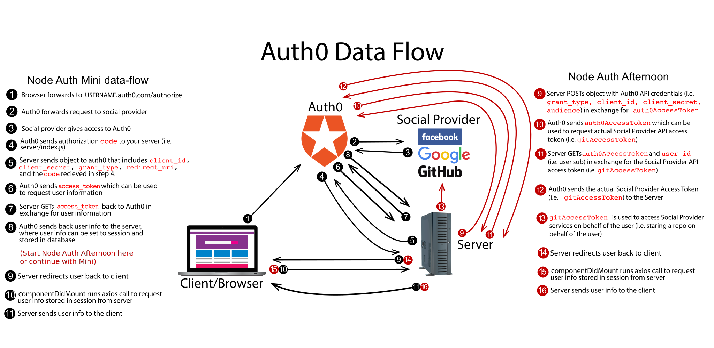

# Project Summary

In this project, we'll continue to use Auth0 but also interact directly with Github's API on behalf of your user. At the end of this project, you'll have a node back end that can authorize with GitHub and star and unstar a repository of your choice.

To simplify the project, we won't be using a database like we did in the mini project. That's an extra step you'd need to add for e.g. a personal project.

## Setup

* Fork and clone this repository.
* `cd` into the project directory.
* Run `npm install` to get the provided dependencies.
* Copy `.env.example` to `.env`.
  * Fill out a value for SESSION_SECRET.
  * Important: add `.env` to the list of ignored files in the `.gitignore` file.

Here's a diagram of data flow for Auth0 that we'll refer to in the steps. Note that there are many ways to approach auth in general and many ways to utilize Auth0; this is just one.



## Step 1

### Summary

In this step, we'll create a new Application in Auth0 that represents this project.

### Instructions

* Go to `manage.auth0.com` and login to the account you created in the mini project from earlier.
* Click the `Create Application` button in the top right.
  * Pick a name (recommendation: `node-auth-afternoon`).
  * Change the `Application Type` to `Single Page Web Applications`.
  * Click Create.
  * Switch to the application's `Settings` tab.
  * Change the `Allowed Callback URLs` to `http://localhost:3000/callback`.
  * At the bottom, click `Save Changes`.
  * Back at the top of the Settings tab, copy the domain, client ID, and client secret to your project's `.env` file, to `REACT_APP_AUTH0_DOMAIN`, `REACT_APP_AUTH0_CLIENT_ID`, and `AUTH0_CLIENT_SECRET`, respectively. Do NOT start `AUTH0_CLIENT_SECRET` with `REACT_APP_`.
* Click on Connections on the left hand side navigation, and then Social.
  * Enable the GitHub connection if it's not already. Then click the GitHub connection to configure it.
  * Leave the Client ID and Client Secret sections blank, such that you'll be using Auth0's dev keys.
  * In the Attributes section, check Email address. Click Save.
  * In the Permissions section, check `read:user` and `repo`. Click Save.
  * At the top of the same GitHub modal, click on Applications. Enable your `node-auth-afternoon` application (or whatever you named it), if it's not already.
* Click on APIs in the left hand side navigation.
  * Click on Auth0 Management API.
  * Go to the API Explorer tab.
  * You should see a button that says "Create and authorize a test application". Click it. After you've done this once, you'll see a really long token string (which you don't need).
* Return to the Applications section of the Auth0 website. You should now see an application named "API Explorer Application".
  * Click it and you should be taken to its Settings tab. Copy the client ID and client secret to the `.env` file under `AUTH0_API_CLIENT_ID` and `AUTH0_API_CLIENT_SECRET`, respectively. Do NOT start these values with `REACT_APP_`.

## Step 2

### Summary 

In this step, we'll use `npm` to get the dependencies we'll need for our project. We'll also manually modify our `package.json` file for the sake of proxying.

### Instructions

* Install `body-parser`, `axios`, `express-session`, and  `dotenv`.
* Modify the webpack dev server such that we proxy JSON requests meant for `/api` to the server. We also need to proxy all requests meant for `/callback` to the server. If we don't do the following, the webpack dev server will intercept requests to `/callback` and serve the `public/index.html` file, which is not what we want for that route.
  * Open `package.json`.
  * Change the property named `proxy`. Change it from its current string value to a JSON object.
    * To the JSON object, add a key of `/callback`. Set its value to a JSON object with a key of `target` and a value of `http://localhost:4000`.
    * Add another key for `/api` with the same value.

### Solution

<details>

<summary> <code> NPM Install </code> </summary>

```
npm install body-parser axios express-session dotenv
```

</details>

<details>

<summary> <code> package.json </code> </summary>

```
{
  ...
  "proxy": {
    "/callback": {
      "target": "http://localhost:4000"
    },
    "/api": {
      "target": "http://localhost:4000"
    }
  }
}
```

</details>


## Step 3

### Summary

In this step, we'll set up `express-session` so we have a place to store our user's unique data when they log in.

### Instructions

* Open `server/index.js`.
* Require `express-session` as a variable named `session`.
* Invoke `session` and pass it an object with your session configurations.
  * Hint: `secret`, `resave`, and `saveUninitialized`.
* Next, wrap your invoked session with `app.use()` so that it gets used in all routes. 
* Finally, `require` the rest of the packages from the previous step (e.g. `axios`, etc).
  * Call `config` on `dotenv`.
  * Use body parser as middleware.

### Solution

<details>

<summary> <code> server/index.js </code> </summary>

```js
const express = require('express');
const session = require('express-session');
const bodyParser = require('body-parser');
const axios = require('axios');
require('dotenv').config();

const app = express();
app.use(bodyParser.json());
app.use(session({
  secret: process.env.SESSION_SECRET,
  resave: false,
  saveUninitialized: false
}));
```

</details>

## Step 4

### Summary

In this step, we'll create an outline for our following steps (steps 5-9). We need to do many async calls in a series; we'll use promises to do this in a readable way. You might not have seen promises used this way: without an anonymous function, and seeing multiple chained together. But the callback we supply to a `.then()` just needs to be a function; it doesn't matter if it's an anonymous function or a named one. You can read more about chaining on [MDN](https://developer.mozilla.org/en-US/docs/Web/JavaScript/Guide/Using_promises#Chaining).

### Instructions

* In the `/callback` handler, add the following code. It refers to functions that don't exist yet. You'll create them in the following steps.
  ```js
  app.get('/callback', (req, res) => {
    exchangeCodeForAccessToken()
      .then(exchangeAccessTokenForUserInfo)
      .then(fetchAuth0AccessToken)
      .then(fetchGitHubAccessToken)
      .then(setGitTokenToSession)
  });
  ```
  * After the final `.then()`, put a `.catch()`.
    * It should take in an `error` parameter. Log it to the console.
    * Use `res` to send a response with a status code of 500, and a message that says "An error occurred on the server. Check the terminal.".

### Solution

<details>

<summary> <code> server/index.js </code> </summary>

```js
app.get('/callback', (req, res) => {
  exchangeCodeForAccessToken()
    .then(exchangeAccessTokenForUserInfo)
    .then(fetchAuth0AccessToken)
    .then(fetchGitHubAccessToken)
    .then(setGitTokenToSession)
    .catch(error => {
      console.log('Server error', error);
      res.status(500).send('An error occurred on the server. Check the terminal.');
    });
});
```

</details>
  
## Step 5

### Summary

In this step, we'll create the `exchangeCodeForAccessToken` function. We'll create a payload of data to send to Auth0, and send it using axios. This is step 5 in the diagram.

### Instructions

* Still in the `/callback` handler, below the code block you pasted from the previous step, declare a function called `exchangeCodeForAccessToken`.
* In the function, make an object called payload that has the following properties:
  * `client_id` (use value from `.env` REACT_APP_AUTH0_CLIENT_ID)
  * `client_secret` (use value from `.env` AUTH0_CLIENT_SECRET)
  * `code` (the `code` we expect to recieve from Auth0 attached to `req.query` when our `/callback` endpoint is hit)
  * `grant_type` (which should be `authorization_code`)
  * `redirect_uri` which should redirect back to `http://${req.headers.host}/callback`
    * (note: it's "uri", not "url")
    * (help: `req.headers.host` is a way to say "use whatever domain and port I'm already using", which means that we won't need to change the code even if we change our domain or port).
* Return a promise, in the form of an axios post.
  * The returned axios request should post to your `https://${process.env.REACT_APP_AUTH0_DOMAIN}/oauth/token`. 
  * Send the `payload` object as the body of the post.

### Solution

<details>

<summary> <code> server/index.js </code> </summary>

```js
app.get('/callback', (req, res) => {
  exchangeCodeForAccessToken()
    .then(exchangeAccessTokenForUserInfo)
    .then(fetchAuth0AccessToken)
    .then(fetchGitHubAccessToken)
    .catch(error => {
      console.log('Server error', error);
      res.status(500).send('An error occurred on the server. Check the terminal.');
    });

  function exchangeCodeForAccessToken() {
    const payload = {
      client_id: process.env.REACT_APP_AUTH0_CLIENT_ID,
      client_secret: process.env.AUTH0_CLIENT_SECRET,
      code: req.query.code,
      grant_type: 'authorization_code',
      redirect_uri: `http://${req.headers.host}/callback`
    };

    return axios.post(`https://${process.env.REACT_APP_AUTH0_DOMAIN}/oauth/token`, payload);
  }
});
```

</details>

## Step 6

### Summary

In this step we are going to write a function that will be invoked after our `exchangeCodeForAccessToken` function called `exchangeAccessTokenForUserInfo`. Its job is to take the access token we just fetched and send it to Auth0, which will send us back user info. It might seem odd to make two different calls to Auth0 (one with the code and the second with the access token), but that's how the API works. This is step 7 in the diagram.

### Instructions

* In your `/callback` endpoint, under your `exchangeCodeForAccessToken` function, write another function and call it `exchangeAccessTokenForUserInfo`.
  * This function will take in the return value of `exchangeCodeForAccessToken` as a parameter. We often use the name `response` to indicate a response from axios, but on this project, to keep the multiple responses distinct, name the parameter `accessTokenResponse`.
* Send the access token back to Auth0 to get user info:
  * You will need to get the `access_token` out of the `accessTokenResponse`. As in, `accessTokenResponse.data.access_token`.
  * Within your function logic, return a promise in the form of an `axios.get`. The URL should be your Auth0 domain, with path `/userinfo`. The URL should include a query string with a parameter of `access_token` and its value should be the access token from the `accessTokenResponse`.

### Solution

<details>

<summary> <code> server/index.js </code> </summary>

```js
function exchangeAccessTokenForUserInfo(accessTokenResponse) {
  const accessToken = accessTokenResponse.data.access_token;
  return axios.get(`https://${process.env.REACT_APP_AUTH0_DOMAIN}/userinfo?access_token=${accessToken}`); 
}
```

</details>

## Step 7

### Summary

In this step we are going to set the user information to session, then make a call to the  `API Explorer Application` we registered in step 1 so we can get an Auth0 `access_token`. Whereas the previous access token was on behalf of the user using our app, we also need an access token to access Auth0 as our app. This is step 9 (red) in the diagram.

### Instructions

* Underneath the `exchangeAccessTokenForUserInfo` function, write another function called `fetchAuth0AccessToken` that takes in `userInfoResponse`.
* Set `req.session.user` to the data from the `userInfoResponse`.
  * If you were to log the data, you'd see a property called `sub`, which is short for `subject`, and should look like `github|1234567`. It represents the user in the Auth0 system. We'll use it in the next step.
* Next, construct an object called `payload` and give it the following properties:
  * `grant_type`: 'client_credentials'
  * `client_id`: process.env.AUTH0_API_CLIENT_ID
  * `client_secret`: process.env.AUTH0_API_CLIENT_SECRET
  * `audience`: `https://${process.env.REACT_APP_AUTH0_DOMAIN}/api/v2/`
* Finally, return a promise in the form of an `axios.post` request to your Auth0 domain at the path `/oauth/token` and send the `payload` object we just created as the body of the post.

### Solution

<details>

<summary> <code> server/index.js </code> </summary>

```js
function fetchAuth0AccessToken(userInfoResponse) {
  req.session.user = userInfoResponse.data;

  const payload = {
    grant_type: 'client_credentials',
    client_id: process.env.AUTH0_API_CLIENT_ID,
    client_secret: process.env.AUTH0_API_CLIENT_SECRET,
    audience: `https://${process.env.REACT_APP_AUTH0_DOMAIN}/api/v2/`
  };

  return axios.post(`https://${process.env.REACT_APP_AUTH0_DOMAIN}/oauth/token`, payload);
}
```

</details>

## Step 8

### Summary

In this step we are going to use the Auth0 access token from the previous step to fetch an access token for use with GitHub. It will allow us to make REST calls to GitHub on behalf of the user. This is step 11 (red) in the diagram.

### Instructions

* Under the `fetchAuth0AccessToken` function, write another function and call it `fetchGitHubAccessToken`. This function will accept a parameter (i.e. the return value from the previous step) that we'll call `auth0AccessTokenResponse`.
* Within the function, create an object and call it `options`.
  * This object has one property called `headers` which is equal to an object with the property `authorization`.
  * Set the `authorization` property equal to `Bearer ${auth0AccessTokenResponse.data.access_token}`.
* Next, underneath the object in the same function, return a promise in the form of an `axios.get` to `https://${process.env.REACT_APP_AUTH0_DOMAIN}/api/v2/users/${req.session.user.sub}`. Note how we're using the `sub` mentioned in the previous step to indicate that we want an oauth token for that user.
  * Pass the `options` object as the second argument to `axios.get`.
  * Remember, the options object is not the same thing as sending a body. Every axios request can accept an options parameter so you can change, e.g., what is in the headers. Read more here on the structure for axios calls in the [Axios Docs](https://github.com/axios/axios#request-method-aliases).
  * Using an `authorization` header with a value that starts with `Bearer` is a common way of sending credentials in REST calls.

### Solution

<details>

<summary> <code> server/index.js </code> </summary>

```js
function fetchGitHubAccessToken(auth0AccessTokenResponse) {
  const options = {
    headers: {
      authorization: `Bearer ${auth0AccessTokenResponse.data.access_token}`
    }
  };
  return axios.get(`https://${process.env.REACT_APP_AUTH0_DOMAIN}/api/v2/users/${req.session.user.sub}`, options);
}
```

</details>

## Step 9

### Summary

In this step, we are going to build a function which gets the access token from the response of the previous function, puts it on our session at `req.session.gitHubAccessToken`, then redirects our user back to the home page.

### Instructions

* Under the `fetchGitHubAccessToken` function, write a function called `setGitTokenToSession` which takes in the return value from the previous function as a parameter. Call the parameter `gitHubAccessTokenResponse`.
* If you look at `gitHubAccessTokenResponse.data`, you'll see an array of `identities`.
  * Set `req.session.gitHubAccessToken` equal to `gitHubAccessTokenResponse.data.identities[0].access_token`.
* In the data of the `gitHubAccessTokenResponse`, there should be an array of `identities` (with only one identity: GitHub). On that identity should be an `access_token` property. Put that access token on the session at `req.session.gitHubAccessToken`.
* Redirect the user back to our landing page (`'/'`) using `res.redirect`.
* (We're now done writing code within the `/callback` endpoint.)

### Solution

<details>

<summary> <code> server/index.js </code> </summary>

```js
function setGitTokenToSession(gitHubAccessTokenResponse) {
  const githubIdentity = gitHubAccessTokenResponse.data.identities[0];
  req.session.gitHubAccessToken = githubIdentity.access_token;
  res.redirect('/');
}
```

</details>

## Step 10

### Summary

In this step, we are going to use the GitHub access token from the previous step (which is in the session) to make calls to the GitHub API and star/unstar repos on the user's behalf. The access token we're using must be kept secure; we can't expose/use it on the client side so we use it from the server side. This is step 13 (red) in the diagram.

### Instructions

* Still in `server/index.js`, but now outside of the `/callback` endpoint:
* Create a PUT endpoint with the path `/api/star`.
* In the endpoint handler function, deconstruct `gitUser` and `gitRepo` from `req.query`.
* Make an axios PUT request to `https://api.github.com/user/starred/${gitUser}/${gitRepo}`.
* In order to authorize our request, GitHub needs the access token we set to `req.session.gitHubAccessToken`.
  * Send the user's access token as a query parameter of our put request (i.e `?access_token=...`).
* Next, within the `.then` of our put request we will close out our response with `res.end()` which signifies the request was successful but that no data is being passed back to the client.
  * Don't forget to put a `.catch()`.
* In addition, set up a DELETE endpoint on `/api/star`. The only difference is the axios call within this new endpoint makes an `axios.delete` call instead of an `axios.put`.

### Solution

<details>

<summary> <code> server/index.js </code> </summary>

```js
app.put('/api/star', (req, res) => {
  const { gitUser, gitRepo } = req.query;
  axios.put(`https://api.github.com/user/starred/${gitUser}/${gitRepo}?access_token=${req.session.gitHubAccessToken}`).then(() => {
    res.end();
  }).catch(err => console.log('Error starring repo', err));
});

app.delete('/api/star', (req, res) => {
  const { gitUser, gitRepo } = req.query;
  axios.delete(`https://api.github.com/user/starred/${gitUser}/${gitRepo}?access_token=${req.session.gitHubAccessToken}`).then(() => {
    res.end()
  }).catch(err => console.log('Error unstarring repo', err));
});
```

</details>

## Step 11

### Summary

The last step in our project is to set up the function which will initiate the user's login request on the website.  This is step 1 in the diagram.

### Instructions

* Open `src/App.js` and locate the `login` function.
* Make a variable called `redirectUri` and set it equal to `` encodeURIComponent(`${window.location.origin}/callback`) ``.
  * Learn about [encodeURIComponent](https://developer.mozilla.org/en-US/docs/Web/JavaScript/Reference/Global_Objects/encodeURIComponent)
  * (Doing `window.location.origin` is similar to what we did earlier with `req.headers.host`, except instead of on the server it's for use on the client. It means "whatever domain and port the user's browser is currently visiting".)
* Next we are going to direct the browser to our Auth0 login screen by setting `window.location` equal to `https://${process.env.REACT_APP_AUTH0_DOMAIN}/authorize`. We will also want to pass along a few queries:
  * `client_id=${process.env.REACT_APP_AUTH0_CLIENT_ID}`
  * `scope=openid%20profile%20email`
    * `%20` is [percent-encoding](https://en.wikipedia.org/wiki/Percent-encoding) for a space character. We also could have just used regular spaces and ran the value through `encodeURIComponent()`.
  * `redirect_uri=${redirectUri}`
  * `response_type=code` (code here just means the string 'code')
  * (hint: remember the '&' symbol is used to chain queries onto a url)

``` js
login = () => {
  const redirectUri = encodeURIComponent(`${window.location.origin}/callback`);

  window.location = `https://${process.env.REACT_APP_AUTH0_DOMAIN}/authorize?client_id=${process.env.REACT_APP_AUTH0_CLIENT_ID}&scope=openid%20profile%20email&redirect_uri=${redirectUri}&response_type=code`
}
```

You should now be able to login via Auth0 (GitHub) and star and unstar repositories.

## Black Diamond

* We have a PUT endpoint at `/api/star` and a delete endpoint at `/api/star`. They have almost identical code. DRY it up and turn it into a single endpoint.
  * It's the same story from the client side code (which you didn't write). Change that code from having a code block for the PUT and another one for DELETE into a single code block that chooses whether to use a PUT or DELETE based on the current `starred` state.
* Now that you know how to allow your users to make API calls to GitHub from inside your application, go explore the docs and see what cool features you can add to your projects.
  * [GitHub API Docs](https://developer.github.com/v3)

## Contributions

If you see a problem or a typo, please fork, make the necessary changes, and create a pull request so we can review your changes and merge them into the master repo and branch.

## Copyright

© DevMountain LLC, 2018. Unauthorized use and/or duplication of this material without express and written permission from DevMountain, LLC is strictly prohibited. Excerpts and links may be used, provided that full and clear credit is given to DevMountain with appropriate and specific direction to the original content.
